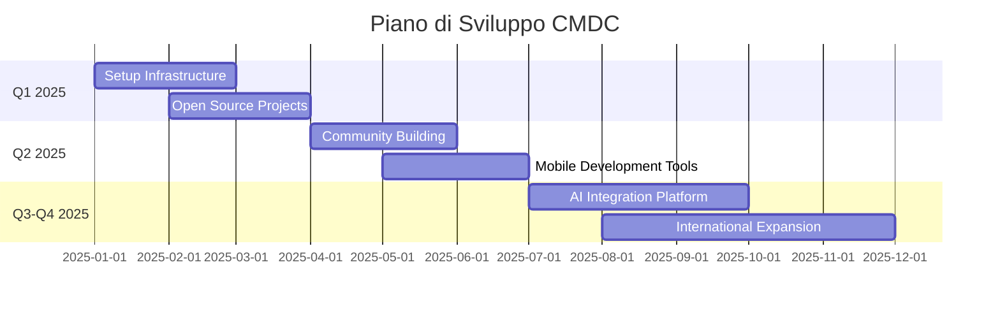

<div align="center">


# cmdc

### Innovation & Technology Solutions

[](http://cmdc.it)
[](mailto:cmdc.business@gmail.com)
[](https://twitter.com/cmdc)
[](https://maps.google.com)

---


### 👋 Chi Siamo

Benvenuti su **CMDC**! Siamo un'organizzazione italiana dedicata all'innovazione tecnologica e allo sviluppo di soluzioni digitali all'avanguardia.

</div>

## 💡 La Nostra Missione

Creare soluzioni tecnologiche innovative che aiutino le aziende e i professionisti a crescere nell'era digitale. Ci impegniamo a:

- 🎯 **Innovare** - Sviluppare tecnologie all'avanguardia
- 🤝 **Collaborare** - Costruire una community di sviluppatori e tech enthusiast
- 🌍 **Espandere** - Portare le nostre soluzioni a livello globale
- 📚 **Condividere** - Open source e knowledge sharing

## 🛠️ Tecnologie & Stack

Lavoriamo con le tecnologie più moderne per garantire soluzioni performanti e scalabili:

<div align="center">


</div>

## 🎯 Le Nostre Attività

<table>
<tr>
<td width="50%">

### 💼 Servizi

- **Sviluppo Software Custom**
  - Applicazioni web e mobile
  - Soluzioni enterprise
  - API e microservizi

- **Consulenza Tecnologica**
  - Architettura software
  - Code review e optimization
  - DevOps e CI/CD

- **Digital Transformation**
  - Cloud migration
  - Modernizzazione legacy systems
  - Automation & AI integration

</td>
<td width="50%">

### 📈 Focus Areas

```
Web Development      ████████████░░░░░░░░  60%
Mobile Solutions     ████████░░░░░░░░░░░░  40%
Cloud & DevOps       ██████████░░░░░░░░░░  50%
AI & Automation      ██████░░░░░░░░░░░░░░  30%
Data Analytics       ████████░░░░░░░░░░░░  40%
```

### 🌟 Competenze Chiave


</td>
</tr>
</table>

## 🗺️ Roadmap 2025

<div align="center">



</div>

## 📊 I Nostri Progetti

### 🚀 Progetti Attivi

<table>
<tr>
<td width="33%" align="center">

<br><strong>Web Framework</strong>
<br><sub>Framework modulare per applicazioni web</sub>
<br>🟢 In sviluppo
</td>
<td width="33%" align="center">

<br><strong>DevOps Toolkit</strong>
<br><sub>Tool per automatizzare deploy e monitoring</sub>
<br>🟡 Planning
</td>
<td width="33%" align="center">

<br><strong>Data Pipeline</strong>
<br><sub>Sistema di processing dati real-time</sub>
<br>🟡 Planning
</td>
</tr>
</table>

### 💡 Prossimi Progetti

- 🔧 **Developer Tools** - CLI e plugin per aumentare la produttività
- 🌐 **SaaS Platform** - Piattaforma cloud-native multi-tenant
- 📱 **Mobile SDK** - Librerie per sviluppo mobile cross-platform
- 🤖 **AI Assistant** - Chatbot intelligente per customer support
- 📊 **Analytics Dashboard** - Sistema di monitoring e reporting

## 📈 Statistiche & Metriche

<div align="center">

| 🎯 Progetti | 💻 Tecnologie | 🌍 Clienti | ⭐ GitHub Stars |
|:---:|:---:|:---:|:---:|
| **15+** | **25+** | **10+** | **Growing** |

### 📅 Attività Recenti


</div>

## 🤝 Contribuisci

Siamo sempre alla ricerca di collaboratori talentuosi! Se sei interessato a:

- 💻 Sviluppare progetti open source
- 🎨 Contribuire con design e UX/UI
- 📝 Scrivere documentazione
- 🐛 Segnalare bug e proporre miglioramenti

Non esitare a contattarci!

## 📞 Contatti

<div align="center">

Hai domande, proposte o vuoi semplicemente dire ciao?

**📧 Email**: [cmdc.business@gmail.com](mailto:cmdc.business@gmail.com)

**🌐 Website**: [cmdc.it](http://cmdc.it)

**🐦 Twitter**: [@cmdc](https://twitter.com/cmdc)

---


### ⭐ Seguici per rimanere aggiornato sui nostri progetti

<sub>Made with ❤️ in Italy 🇮🇹</sub>

<br><br>


</div>
